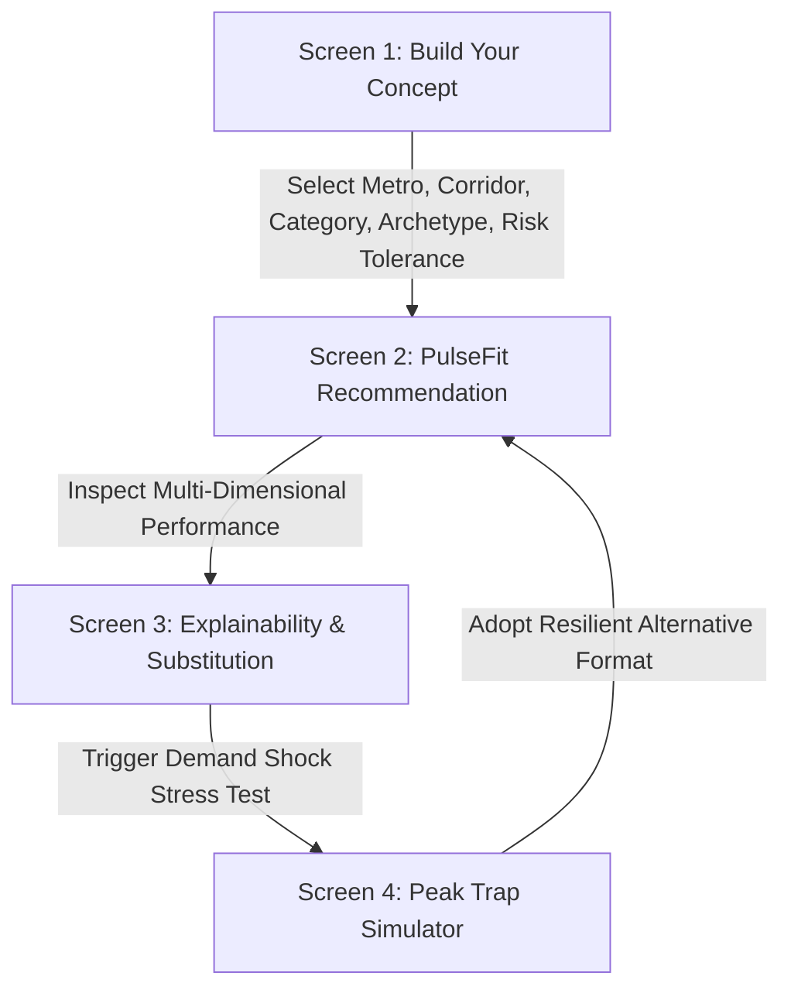

# PULSEFIT Product Specification
*“Choose the operating model, not just the location.”*

---

## 1. Product Vision & Mission

**PulseFit** is a resilience-aware business format decision engine for restaurant and café operators, franchise planners, and commercial developers.

Most commercial real estate tools ask: *“Which corridor is best?”* or show an undifferentiated heat map.
PulseFit flips the paradigm by solving the operator's actual dilemma:

> **“What format should I operate here, when will it actually make money, and how fragile is that strategy?”**

### Core Axioms
1. **Model Over Location**: A prime corridor like Grand Central or Deep Ellum can be an exceptional location for one operating model (e.g. *Office-district street express* or *Late-night beverage lounge*) and financial suicide for another (e.g. *All-day seated brunch cafe* with 7-day high fixed rent).
2. **Beware the Peak Trap**: Corridors with massive 8am or Saturday night spikes lure operators into high overheads that cannot be amortized across off-peak dayparts.
3. **Resilience is Measurable**: True viability requires low seasonality amplitude, balanced event dependency, and shock resistance.

---

## 2. Primary User & Persona

- **Primary Persona**: Restaurant / Specialty Café Founder or Franchise Director evaluating corridor expansion.
- **Key Decision**: Deciding between formats (e.g., *Express Takeaway Counter* vs. *Seated Coffeehouse* vs. *Host-Captive Amenity Kiosk*) in a target corridor, given their risk tolerance.
- **Pain Point**: Real estate brokers sell raw foot traffic numbers without disclosing that 70% of that traffic disappears outside of a 2-hour morning window or weekend surge.

---

## 3. The Core User Journey (4 Primary Views)

### Screen 1: Concept Builder
- **Metro Selection**: New York City (65 corridors, 31 café archetypes) or Dallas–Fort Worth (72 corridors, 31 café + 36 restaurant archetypes).
- **Corridor Picker**: Searchable by name, district, or dominant audience profile.
- **Business Category**: Café or Restaurant.
- **Target Operating Model (Archetype)**: Filterable by Decision Track (`OPEN_MARKET_SITE`, `CONTROLLED_HOST`, `LIVE_OPPORTUNITY`).
- **Risk Tolerance Preference**: Conservative (heavy penalty for peak-dependency and low resilience) vs. Moderate vs. Aggressive (growth-oriented, accepting higher volatility).

### Screen 2: PulseFit Recommendation (Hero View)
- **Headline Verdict**: Direct statement of viability:
  - `OPTIMAL OPERATING MODEL` / `VIABLE WITH OPERATIONAL CONSTRAINTS` / `FRAGILE: PEAK TRAP DETECTED` / `GATED OUT: HOST REQUIRED`.
- **Hero Metrics Bar**:
  - **Resilience-Adjusted Fit** (0–100) vs. **Raw Opportunity Score** (0–100).
  - **Resilience Rating** (Shock resilience, Seasonality, Event dependency).
  - **Peak Dependency Index** (% of opportunity concentrated in single window).
  - **Occasion Breadth** (Number of viable daypart windows $\ge 40$).
- **Daypart Operating Clock**: Visual density breakdown across the 5 canonical dayparts (`weekday_am`, `weekday_midday`, `weekday_evening`, `late_night`, `weekend_day`).

### Screen 3: Why This Model & Archetype Substitution
- **Why This Corridor / Format Works**:
  - Top 3 positive drivers (e.g., *Strong morning commuter flow*, *Broad resident base*, *Low event dependency*).
- **Vulnerabilities / Risks**:
  - Top negative or fragile signals (e.g., *Severe off-peak drop-off*, *High development dependency*).
- **Archetype Substitution Recommender**:
  - Real-time comparison against 2–3 alternatives within the corridor.
  - Automatically identifies whether an alternative model (e.g. *Office Express* vs *Seated Lounge*) yields superior resilience-adjusted fit or lower fixed-cost exposure.

### Screen 4: The Hero Feature — “Peak Trap” Stress Simulator
- **Interactive Demand Shock**:
  - One-click trigger: *“Stress Test Dominant Peak Window”* (simulating a 35%–50% contraction in the dominant daypart due to hybrid work, calendar seasonality, or external friction).
- **Dynamic Recalculation**:
  - Visual delta: *Before (Fit: 84) $\to$ After (Fit: 61)*.
  - Recalculates all metrics and reranks archetypes.
  - **The Pivot Call**: Explicitly displays: *“Your chosen model fell below viability threshold; Alternative format [X] is 22% more resilient under this shock.”*

---

## 4. Scoring Engine Architecture

The scoring engine is **100% deterministic**, inspectable, and reproducible without external APIs or non-deterministic LLMs.

### 4.1 Demand Clock to Daypart Mapping
Archetype `demand_clocks` map deterministically to the corridor's `daypart_occasion_density`:
- `AM_COMMUTE` $\to$ `weekday_am`
- `MIDDAY` $\to$ `weekday_midday`
- `PM_COMMUTE` / `EVENING` $\to$ `weekday_evening`
- `LATE_NIGHT` $\to$ `late_night`
- `WEEKEND` / `WEEKEND_LEISURE` $\to$ `weekend_day`

### 4.2 Mathematical Formulas

1. **Raw Opportunity Fit ($O_{fit}$)**:
   $$O_{fit} = \text{base\_score} \times 100$$
2. **Time Fit ($T_{fit}$)**:
   $$T_{fit} = \frac{\sum_{c \in \text{DemandClocks}} \text{DaypartDensity}[c]}{|\text{DemandClocks}|}$$
3. **Resilience Score ($R_{score}$)**:
   $$R_{score} = 0.45 \cdot S_{res} + 0.25 \cdot (100 - A_{seas}) + 0.15 \cdot (100 - D_{event}) + 0.15 \cdot (100 - D_{dev})$$
4. **Peak Dependency ($P_{dep}$)**:
   $$P_{dep} = \frac{\max(D_{dayparts})}{\sum(D_{dayparts})} \times 100$$
   *(Baseline balanced dayparts $\approx 20\%$; severe peak trap $\ge 35\%$).*
5. **Occasion Breadth ($B_{occ}$)**:
   $$B_{occ} = \sum_{i=1}^5 \mathbf{1}_{D_i \ge 40}$$
6. **Resilience-Adjusted Fit ($F_{adj}$)**:
   $$F_{adj} = O_{fit} \cdot \left[ 1 - \gamma_{risk} \cdot \max\left(0, \frac{P_{dep} - 24}{100}\right) \right] \cdot \left( \frac{R_{score}}{100} \right)^{\beta_{risk}}$$
   Where risk tolerance adjusts $\gamma_{risk}$ and $\beta_{risk}$:
   - Conservative: $\gamma = 0.60, \beta = 0.40$
   - Moderate: $\gamma = 0.35, \beta = 0.25$
   - Aggressive: $\gamma = 0.15, \beta = 0.10$

---

## 5. Explainability Guidelines

Recommendations must never produce generic AI-slop text. Every sentence is generated deterministically from the underlying metrics:
- Exact daypart strengths (e.g. *Weekday AM density: 97/100*).
- Specific resilience drag factors (e.g. *Development dependency index: 48/100 creates construction barrier risk*).
- Clear decision track constraints (e.g. *Controlled host agreement required for airport/terminal concession*).
- Plain language contrast between chosen format and suggested alternative.

---

## 6. MVP vs. Non-MVP Scope

### Strictly in MVP Scope
- Full data integration of all 65 NYC corridors, 72 DFW corridors, 31 Café archetypes, and 36 Restaurant archetypes.
- Fully interactive Concept Builder, Verdict Dashboard, Explainability Panel, and Peak Trap Simulator.
- Complete archetype substitution engine with gated track verification.
- Curated presets for 5 hero demo scenarios demonstrating high-peak, balanced, host-captive, and evening-centric dynamics.
- High-fidelity, polished, editorial UI designed for judging presentation.

### Strictly Out of Scope (Non-MVP Anti-Bloat)
- No user login, auth, or databases.
- No revenue, dollar, or customer headcount forecasting.
- No commercial lease / real estate broker listings.
- No map parcel boundary editing or live GPS tracking.
- No live chatbot or open-ended generative AI prompts.
